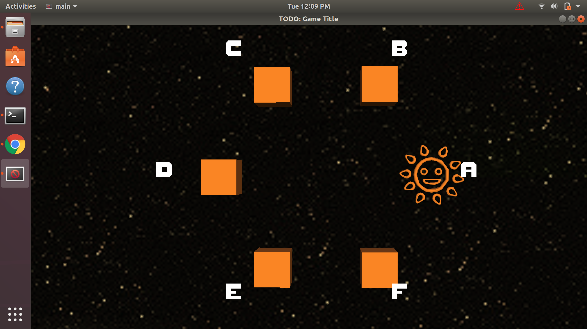

# Game Information

Title: Musical Bloom

Author: Yixin He

Design Document: [Musical Bloom Design Documents](http://graphics.cs.cmu.edu/courses/15-466-f18/game3-designs/ishmaelj/)

Screen Shot:



How To Play:

Press the key corresponding to each box in the order that you are shown.

Changes From The Design Document:
The original design didn't specify how keys would be mapped, so that's my interpretations.  Visuals were changed.

Good / Bad / Ugly Code:

Good: I had some issues with making sure each key press only got added once to the vector holding the current sequence the player pressed. The code resolving this, the use of the vector "selection" is not a particularly "elegant" solution, but I'm pleased that this method managaed to resolve the issue and improve gameplay.

Bad: Wasn't too sure how to make the bloom on bloom selected things, so the way I did it feels mildly hacky. My code repeatedly changes the texture color assigned to items.

Ugly: The placement of the letters is kind of ugly. I wasn't sure how draw text's positioning worked. The clamp works I guess, but I wish it were more consistent with either the letter being inside the item it represents or always to the side of the item.


## Runtime Build Instructions

The runtime code has been set up to be built with [FT Jam](https://www.freetype.org/jam/).

### Getting Jam

For more information on Jam, see the [Jam Documentation](https://www.perforce.com/documentation/jam-documentation) page at Perforce, which includes both reference documentation and a getting started guide.

On unixish OSs, Jam is available from your package manager:
```
	brew install ftjam #on OSX
	apt get ftjam #on Debian-ish Linux
```

On Windows, you can get a binary [from sourceforge](https://sourceforge.net/projects/freetype/files/ftjam/2.5.2/ftjam-2.5.2-win32.zip/download),
and put it somewhere in your `%PATH%`.
(Possibly: also set the `JAM_TOOLSET` variable to `VISUALC`.)

### Libraries

This code uses the [libSDL](https://www.libsdl.org/) library to create an OpenGL context, and the [glm](https://glm.g-truc.net) library for OpenGL-friendly matrix/vector types.
On MacOS and Linux, the code should work out-of-the-box if if you have these installed through your package manager.

If you are compiling on Windows or don't want to install these libraries globally there are pre-built library packages available in the
[kit-libs-linux](https://github.com/ixchow/kit-libs-linux),
[kit-libs-osx](https://github.com/ixchow/kit-libs-osx),
and [kit-libs-win](https://github.com/ixchow/kit-libs-win) repositories.
Simply clone into a subfolder and the build should work.

### Building

Open a terminal (or ```x64 Native Tools Command Prompt for VS 2017``` on Windows), change to the directory containing this code, and type:

```
jam
```

That's it. You can use ```jam -jN``` to run ```N``` parallel jobs if you'd like; ```jam -q``` to instruct jam to quit after the first error; ```jam -dx``` to show commands being executed; or ```jam main.o``` to build a specific file (in this case, main.cpp).  ```jam -h``` will print help on additional options.
